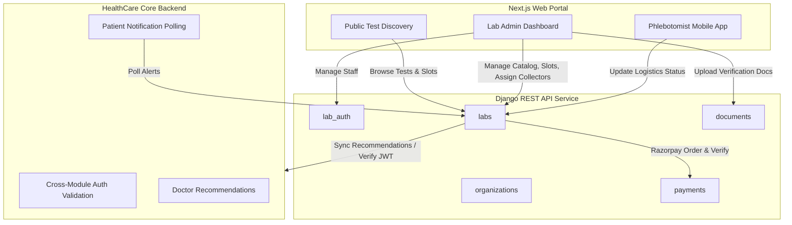

# 🧪 PathyaTech Lab Module Documentation

Welcome to the official developer and operator documentation for the **PathyaTech Lab Module**. This module is a comprehensive, standalone diagnostic and lab management solution within the PathyaTech healthcare ecosystem. It provides end-to-end features from test discovery and booking to logistics tracking, automated reports, payment processing, and doctor-lab collaboration.

---

## 🗂️ Documentation Directory Map

This documentation suite is organized as follows:

| Document | Description |
| :--- | :--- |
| 📖 **[System Architecture](./architecture.md)** | Core design patterns, cross-module authentication, Razorpay payments, notification triggers, and GenericForeignKey document uploads. |
| 🔌 **[Backend API Reference](./backend-api-reference.md)** | Detailed API specs: Auth, Labs, Booking, Slots, Cart, Reports, Documents, and Collaboration. |
| 🎨 **[Frontend Developer Guide](./frontend-guide.md)** | Next.js Page hierarchy, components structure, state context, API service client, and responsive design guidelines. |
| 🛠️ **[Setup & Maintenance](./setup-and-maintenance.md)** | Getting started guide, environment variables setup (`.env.example`), database migrations, and operational guidelines. |
| 🤝 **[Integration: Healthcare Collaboration](./integration-guides/collaboration.md)** | How labs and doctors communicate, post camp/consultation requirements, and exchange real-time messages. |
| 🛒 **[Integration: Cart & Checkout](./integration-guides/cart-and-checkout.md)** | Scheduling logic at the cart, multi-booking orchestration (sub-ordering), and payment flows. |
| 🔔 **[Integration: Notifications & Polling](./integration-guides/notifications-and-polling.md)** | Multi-channel messaging (in-app notifications, polling APIs, SendGrid emails, and SMS integration). |

---

## 🚀 Key Functional Modules

### 1. Public Test Discovery & Slot Management
Patients can browse and search diagnostic tests by category, price, and lab location. They can view available booking slots (`LAB_VISIT` type) or schedule a home sample collection (`HOME` type) with flexible slot timings.

### 2. Multi-Appointment Cart & Orchestration
Unlike standard e-commerce carts, the diagnostic checkout process requires **scheduling at the cart**. Carts can contain tests from different labs or with different visit types, which the backend automatically groups into sub-bookings, generating a single combined payment order.

### 3. Phlebotomist (Collector) Task Force
A dedicated, mobile-first logistics portal designed for field operators. It guides phlebotomists through a strict sequential workflow:
$$\text{SCHEDULED} \longrightarrow \text{PICKED} \longrightarrow \text{IN\_TRANSIT} \longrightarrow \text{REACHED\_FACILITY} \longrightarrow \text{COMPLETED}$$
This guarantees high data integrity, accurate logs, and real-time tracking for patients.

### 4. Healthcare Collaboration (Lab-to-Doctor Chat)
An interactive collaboration portal that allows lab organizations to publish staffing or camp requirements. Doctors from the main HealthCare platform can apply, open conversations, and chat in real-time with lab admins.

---

## 💻 Tech Stack Summary

The Lab module is built as an independent, loosely coupled microservice that interfaces with the main HealthCare platform via pre-shared cryptographic keys (JWT tokens).

### Backend (Django Web Service)
- **Framework**: Python 3.12, Django 6.x
- **API Tooling**: Django REST Framework (DRF) 3.16.x, `djangorestframework_simplejwt`
- **Database**: PostgreSQL (`psycopg2-binary`) or SQLite for development, managed via Django ORM.
- **Payment Gateway**: Razorpay REST SDK
- **File Uploads**: Cloudinary integration (`cloudinary`, `django-cloudinary-storage`)
- **API Documentation**: OpenAPI schemas via `drf-spectacular` and Swagger via `drf-yasg`
- **Email Delivery**: SendGrid Python SDK

### Frontend (Next.js Application)
- **Framework**: Next.js 15 (App Router, Tailwind CSS, TypeScript)
- **HTTP Client**: Axios with interceptors for token validation and automatic JWT refresh
- **Date Handling**: `date-fns` for slot rendering and ISO conversions
- **Icons**: Material Symbols / Material Icons

---

> [!NOTE]
> All code changes, backend migrations, and environment configuration variables should strictly follow the instructions in the [Setup & Maintenance Guide](./setup-and-maintenance.md).
