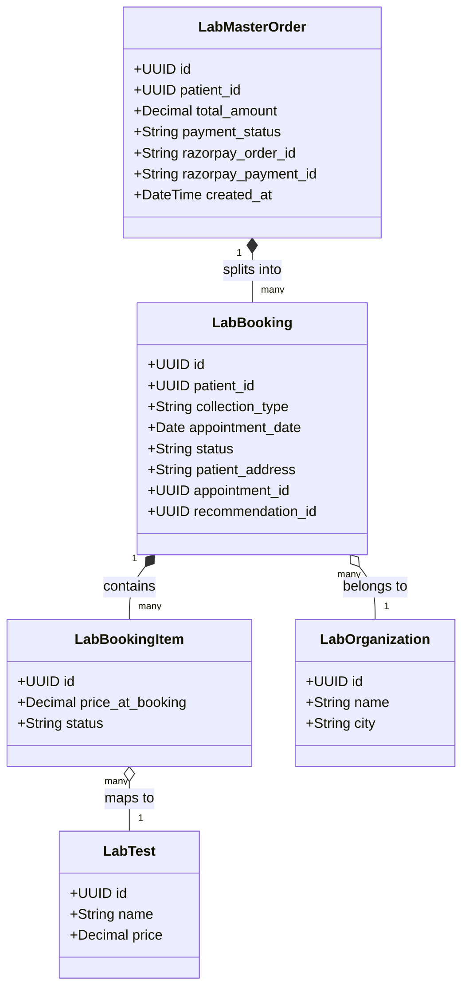
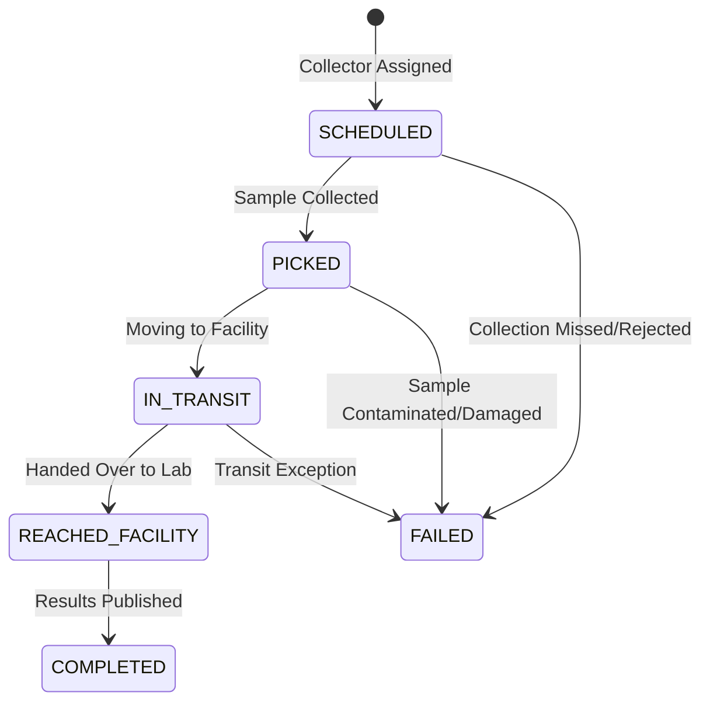

# 📖 System Architecture

This document provides a deep dive into the technical architecture, design patterns, data models, and integrations that form the foundation of the PathyaTech Lab Module.

---

## 1. Microservice Separation & Auth Strategy

The Lab Module is designed as a standalone Django microservice. It manages its own database and internal staff accounts (such as Admins, Technicians, and Operators), but delegates Patient and Doctor management to the main HealthCare platform.

### Cross-Module Authentication
To maintain independence while allowing secure communication, the system uses a shared cryptographic secret key to validate JWT tokens.

```
┌─────────────────────────────────┐        JWT Token        ┌─────────────────────────────────┐
│       HealthCare Frontend       ├────────────────────────>│           Lab Backend           │
└────────────────┬────────────────┘                         └────────────────┬────────────────┘
                 │                                                           │
                 │ 1. Request Login/JWT                                      │ 3. Decode & Verify
                 ▼                                                           ▼
┌─────────────────────────────────┐                         ┌─────────────────────────────────┐
│     HealthCare Core Backend     │                         │   CrossModuleJWTAuthentication  │
└─────────────────────────────────┘                         └────────────────┬────────────────┘
                                                                             │
                                                                             ▼
                                                                  Authenticates request as
                                                                 Patient or Doctor without
                                                                   local database lookup!
```

- **Authentication Class**: `CrossModuleJWTAuthentication` (implemented in `backend/apps/lab_auth/authentication.py`).
- **Mechanism**:
  1. The incoming request contains `Authorization: Bearer <token>`.
  2. The middleware reads the token and decrypts it using `settings.CROSS_MODULE_JWT_SECRET` (shared with the HealthCare platform).
  3. Instead of querying the local Django User database, it initializes a transient user object: `CrossModuleUser`.
  4. Role validation is performed dynamically from the claims embedded in the JWT payload (e.g., `role: "PATIENT"` or `role: "DOCTOR"`).

---

## 2. Order & Booking Hierarchy (Sub-Ordering)

To support bookings containing multiple tests across different laboratories or scheduling requirements, the database implements a master-sub order structure.



1. **`LabMasterOrder`**: Acts as the transaction boundary. It tracks the financial lifecycle of the cart (e.g., `PENDING` $\to$ `PAID` or `FAILED`). It connects directly to Razorpay's API.
2. **`LabBooking` (The Sub-Order)**: Represents a single appointment at a specific lab on a specific date for a specific collection type (`HOME` or `LAB_VISIT`).
3. **`LabBookingItem`**: Represents an individual test inside a booking. This is where clinical statuses are tracked (e.g. `COLLECTED`, `PROCESSING`, `COMPLETED`).

---

## 3. Phlebotomist Logistics Workflow Engine

For `HOME` collections, phlebotomists follow a strict, linear state progression implemented inside `lab_sample_collection.py` models and `lab_booking.py` views.



- **Verification & State Enforcement**: Transition to a new status validates that the previous state was successfully recorded. For instance, a collector cannot mark a sample as `IN_TRANSIT` unless the status is currently `PICKED`.
- **Security Constraints**: Status modifications are restricted via permissions (`IsLabOperator` class) checking that the authenticated user matches the assigned collector.

---

## 4. Multi-Channel Notification Pipeline

The module implements a reactive event-driven notification architecture triggered by model signals (located in `backend/apps/labs/signals.py`).

```
┌─────────────────────────────────┐
│       Model Save/Update         │
│ (e.g. Booking PAID or Report)   │
└────────────────┬────────────────┘
                 │
                 ▼
     [ django.db.models.signals ]
                 │
                 ├───────────────────────────────┐
                 ▼                               ▼
    ┌────────────────────────┐      ┌────────────────────────┐
    │  Create In-App Alert   │      │ Send Grid Transactional│
    │  (LabNotification DB)  │      │         Email          │
    └────────────┬───────────┘      └────────────────────────┘
                 │
                 ▼
    ┌────────────────────────┐
    │ External Polling API   │
    │  (Patient UI updates)  │
    └────────────────────────┘
```

- **In-App Notifications**: Saved to the local database for retrieval via REST endpoints.
- **Cross-Module Sync**: When payments are verified, the backend makes an outgoing API request to the main HealthCare platform to mark recommendations as booked.
- **Transactional Emails**: Dispatched asynchronously via SendGrid during key lifecycle changes:
  - `BOOKING_CONFIRMED`
  - `COLLECTION_UPDATE`
  - `REPORT_UPLOADED`
  - `BOOKING_CANCELLED`

---

## 5. Document Management Architecture

To verify lab profiles, the system uses a general-purpose document upload repository inside `backend/apps/documents/`.

- **Generic Foreign Keys**: Using Django's `ContentType` framework, a single `Document` model is linked dynamically to any model instance (e.g. `LabOrganization`, `UserAddress`, `StaffMember`) without hardcoded foreign keys.
- **Verification Loop**: 
  1. Lab Admins upload files as `multipart/form-data`.
  2. The system uploads files to Cloudinary and saves metadata linked to the Organization ID.
  3. Platform Superadmins view documents and toggle the `is_verified` state, which automatically transitions the lab organization's verification status from `PENDING` to `VERIFIED`.
