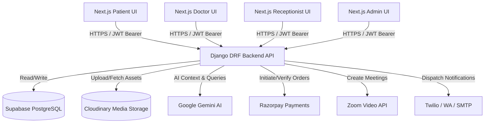
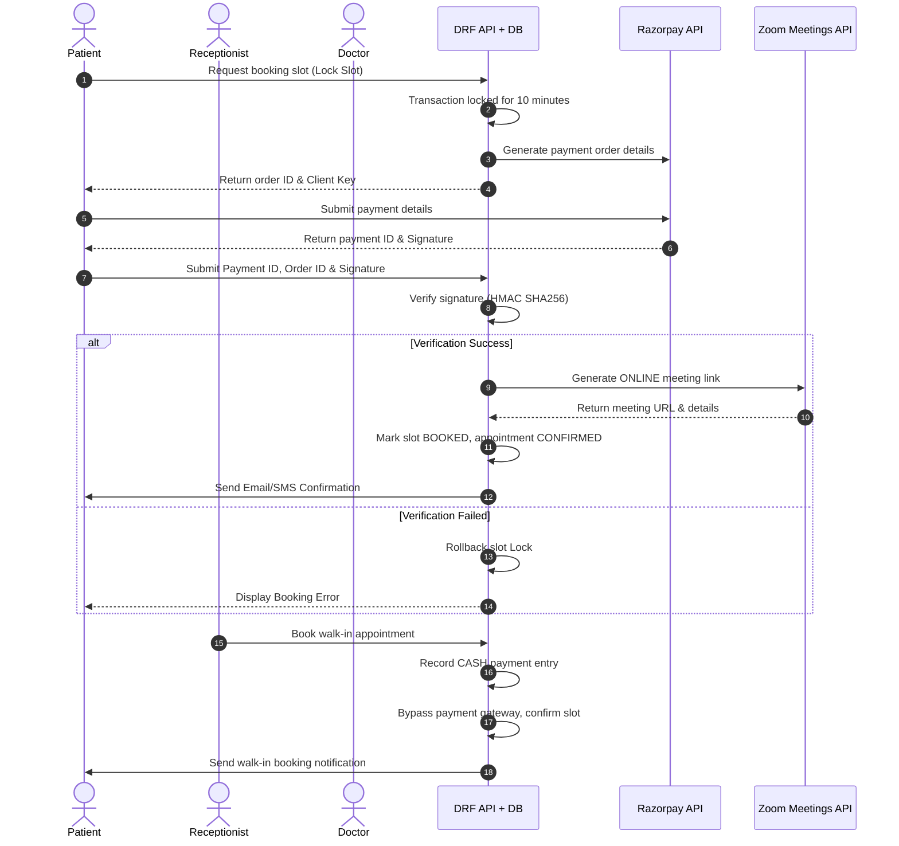

# PathyaTech System Architecture & Design

This document details the system architecture, component dependencies, databases, media storage, and third-party integrations that power the PathyaTech Healthcare Platform.

---

## 1. High-Level Architecture Overview

PathyaTech uses a decoupled, service-oriented architecture:
- **Frontend Client**: Built with **Next.js 14+ (App Router)** and TypeScript. It implements a multi-role user dashboard layout (Patient, Doctor, Receptionist, Admin) styling with global and page-specific vanilla CSS modules.
- **Backend API Server**: Built with **Django REST Framework (DRF)** in Python. It exposes a stateless REST API, serving JSON payloads, managed via JWT token authentication.
- **Databases & Storage**:
  - **PostgreSQL (via Supabase)**: Host for core relational data, using connection pooling for scalable request handling.
  - **Cloudinary**: Cloud-based storage for rich media assets (PDF lab reports, clinic marketing Reels, profile pictures, and verification credentials).
- **Third-Party Integrations**:
  - **Razorpay**: Financial gateway for consultation bookings and diagnostics checkouts.
  - **Google Gemini AI**: Cognitive services powering diet recommendations, lab report interpretation, and custom clinical assistance.
  - **Zoom API**: Automatic virtual room creation for online appointments.
  - **Communication Gateways**: Twilio (SMS), WhatsApp Business API, and SMTP for email triggers.

---

## 2. Component Integration Details

### A. Next.js Frontend Client
- **App Router Routing**: Folder-based routing handles page generation. Main modules include `/patient`, `/doctor`, `/clinic` (receptionist), `/platform` (admin), and `/auth` (signup/login/OTP verification).
- **State Management**: React **Context API** holds session states, authentication credentials, and user role tokens.
- **API Services Layer**: Service classes (under `src/services/`) decouple view components from network operations.

### B. Django REST API Server
- **Stateless Design**: Uses simple JWT tokens in request headers to identify and authenticate sessions.
- **Auto OpenAPI Documentation**: Configured with `drf-spectacular` to automatically generate Swagger UI (`/api/docs/`) and ReDoc (`/api/redoc/`) pages from serializers and view docstrings.
- **Modular App Layout**: Divided into focused Django apps (e.g., `auth_app`, `patients`, `doctors`, `appointments`, `prescriptions`, `payments`, `communication`, `content`, `subscriptions`).

### C. Supabase PostgreSQL
- Relational schema optimized with unique indexes on lookup columns (like emails, phone numbers, and UUID tokens).
- Leverages PostgreSQL constraints to prevent data duplication (e.g., preventing duplicate lab tests in a user's cart).

### D. Google Gemini AI Engine
Implements three distinct clinical assistance nodes:
1. **Diagnosis Assist**: Processes patient health metrics, chronic conditions, and medical summaries to return a structured JSON response listing potential conditions, confidence levels, and suggestions.
2. **Report Analysis**: Extracts text from diagnostic report models, translating reference ranges and raw biomarkers into clinical briefings.
3. **Custom Suggestion**: Answers doctor's specific clinical questions by scanning and summarizing patient files.

### E. Razorpay Gateway Integration
- **Order Creation**: Triggered server-side to fetch amounts from appointment slots, ensuring client-side security.
- **Signature Verification**: Verifies payments on the server using HMAC SHA256 hashing to validate Razorpay request signatures before modifying appointment and subscription states.

---

## 3. Communication & Notification Data Flow

