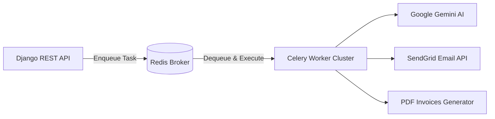

# PathyaTech Launch Strategy & Production Roadmap

This document serves as the operational guide and technical checklist for transitioning the PathyaTech Healthcare Platform from staging and local development environments to production.

---

## 1. Production Integration Checklist

### A. SMS OTP & Messaging Gateway
- **Staging Setup:** Simulated console logs or basic transactional email templates.
- **Production Target:** Integrate a production-grade SMS provider (e.g., Twilio, Msg91, Fast2SMS) for phone verification and alert triggers.
- **Actions:**
  1. Register a verified sender ID and obtain regulatory templates (e.g., DLT registration in India).
  2. Swap credentials in the environment configuration:
     ```env
     SMS_API_KEY=your-production-gateway-secret-key
     SMS_SENDER_ID=PATHYA
     ```
  3. Update `apps/auth_app/views/otp.py` to route dispatch commands to the SMS gateway REST API instead of mock logs.

### B. Razorpay Live Credentials
- **Staging Setup:** Sandbox API keys with simulated success/failure callbacks.
- **Production Target:** Move to live payment processing.
- **Actions:**
  1. Generate live API keys in the Razorpay Dashboard.
  2. Configure production webhooks pointing to `https://api.pathyatech.com/api/payments/verify-payment/`.
  3. Register the webhook secret signature key for cryptographic verification:
     ```env
     RAZORPAY_KEY_ID=rzp_live_xxxxxxxxxxxxxx
     RAZORPAY_KEY_SECRET=production-secret-hash-key
     RAZORPAY_WEBHOOK_SECRET=production-webhook-secret-hash
     ```

### C. Enterprise Zoom Meeting Integration
- **Staging Setup:** Simulated zoom links or personal developer meeting rooms.
- **Production Target:** Automated scheduling for verified online doctor consults.
- **Actions:**
  1. Create a Zoom Server-to-Server OAuth application in the Zoom App Marketplace.
  2. Secure client IDs and account IDs:
     ```env
     ZOOM_ACCOUNT_ID=your-zoom-account-id
     ZOOM_CLIENT_ID=your-zoom-client-id
     ZOOM_CLIENT_SECRET=your-zoom-client-secret
     ```
  3. Establish token refresh hooks in `apps/appointments/services/zoom.py` to schedule meetings dynamically on slot booking.

---

## 2. Scalability & Background Task Queue (Celery + Redis)

To ensure the main HTTP threads remain fast and responsive, time-consuming operations must be delegated to background workers.



### Async Operations Pipeline:
1. **Gemini AI Analysis:** Offload diagnostic parses and report analyses (averaging 2–5 seconds latency).
2. **Transactional Notifications:** Dispatching bulk emails via SendGrid and SMS alerts.
3. **PDF Document Generation:** Compiling prescription files and patient invoice statements.
4. **Appointment Reminders:** A cron-like scheduler (`celery-beat`) checking database slots every 10 minutes to trigger SMS/WhatsApp alerts for upcoming appointments (e.g., 2 hours before start time).

---

## 3. Infrastructure & Telemetry Roadmap

### A. Database Optimizations
- **Connection Pooling:** Configure **pgBouncer** on the Supabase PostgreSQL cluster to scale simultaneous database connections.
- **Read/Write Split:** Setup database replicas to handle search-heavy queries (e.g., browsing doctor listings) and route mutations to the primary master instance.
- **Backup Strategy:** Configure automated hourly transaction log snapshots and daily backups with geographical replication.

### B. Telemetry & Error Monitoring
- **Sentry Integration:** Initialize Sentry SDKs in both Next.js and Django DRF codebases to capture live runtime errors and stack traces.
- **Prometheus & Grafana:** Export application metrics (CPU, RAM, API response latency, request counts, queue lengths) to Grafana dashboards with slack/pager alerts for system anomalies.

### C. SEO & Pre-rendering (Next.js Client)
- **SSR & Metadata:** Use Next.js App Router dynamic metadata overrides to generate titles, descriptions, and Open Graph cards for doctor listings and clinic health articles, optimizing search ranking.
