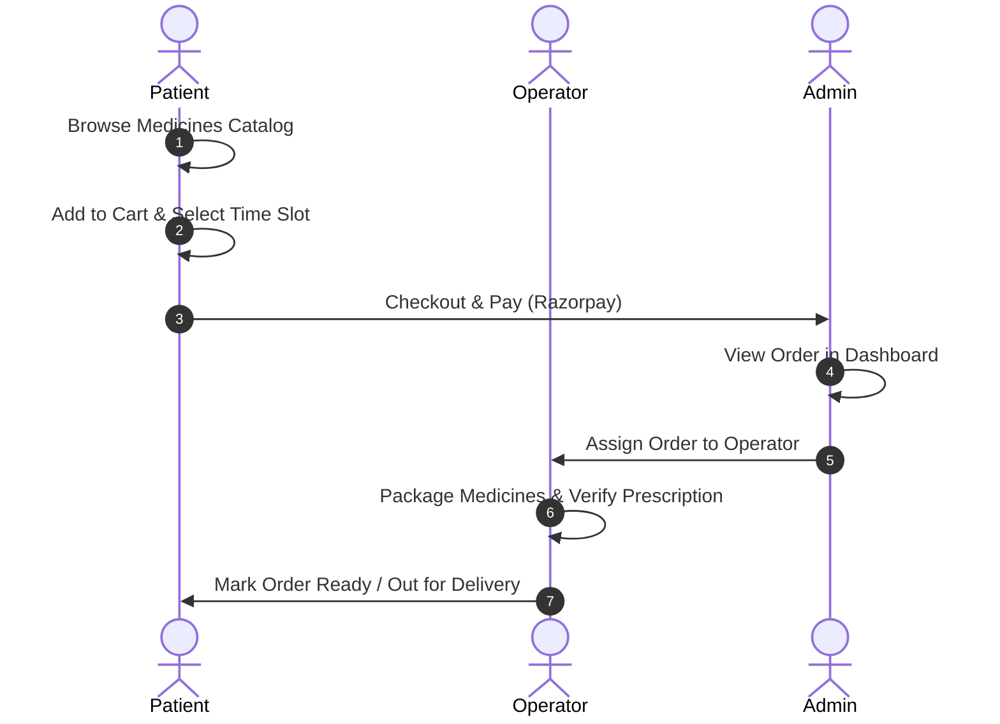

# Pharmacy Module - Actor Workflows

This document outlines the workflows, lifecycles, and capabilities of the different actors interacting with the Pharmacy platform.

---

## 1. Patient Workflow (External Client)

Patients interact with the public-facing pages of the system to purchase medications and schedule collections.

### Workflow Steps:
1. **Browse Catalog**: The patient searches for required medicines, filters by category or pharmacy, and compares prices.
2. **Add to Cart**: Adds items to the cart. For each item, the patient specifies the collection type:
   * **Home Collection**: Delivered directly to the patient's address. The patient selects an active home timing slot.
   * **Pharmacy Visit**: Collected physically from the store. The patient selects a specific date and time slot.
3. **Checkout**: The patient initiates payment. A `PharmacyMasterOrder` is created to contain the sub-orders.
4. **Payment**: The system loads the Razorpay checkout overlay. Once completed, the order status changes to `PAID`/`BOOKED` and notifications are fired.
5. **Collection/Delivery**: The patient either visits the pharmacy during the selected slot or receives their package at home via an assigned delivery agent.

---

## 2. Pharmacy Admin Workflow (Internal Owner)

Admins own the pharmacy workspace and oversee all business settings, scheduling, catalog management, and personnel.

### Workflow Steps:
1. **Registration & Bootstrap**: Registers an account with the role `PHARMACY_ADMIN`. Upon verifying their email via OTP, a default `PharmacyOrganization` and matching membership are bootstrapped.
2. **Profile & Compliance**: Uploads business licenses and registration certificates to the documents upload API for verification by the platform managers.
3. **Configure Catalog**: Adds, updates, or deletes medicines in their catalog, setting base prices, discounts, and home collection availability.
4. **Manage Schedule**: Sets daily operation timings and sets maximum booking capacity per time slot.
5. **Manage Staff**: Dispatches invitations or creates accounts for `PHARMACY_OPERATOR` and `PHARMACY_STAFF` users, binding them to their organization.
6. **Financial Operations**: Monitors payment records, views payout logs, and initiates refunds for cancelled bookings.

---

## 3. Pharmacy Operator Workflow (Internal Intake)

Operators are administrative clerks handling day-to-day order intakes and patient support.

### Workflow Steps:
1. **Queue Monitoring**: Reviews the incoming orders queue in real-time.
2. **Order Approval**: Validates that selected medicines are in stock and verifies reservation times.
3. **Customer Support**: Handles requests for rescheduling collection slots or updating patient details.

---

## 4. Pharmacy Staff Workflow (Internal Fulfillment)

Staff are floor technicians and delivery coordinators responsible for the physical preparation and dispatch of orders.

### Workflow Steps:
1. **Preparation**: Picks medicines for active bookings.
2. **Prescription Verification**: Inspects uploaded patient prescription documents. Staff upload a verified copy of the prescription to the database before the order is finalized.
3. **Dispatch**: Assigns delivery agents for home collection orders and marks status changes (`PICKED`, `IN_TRANSIT`, `COMPLETED`).
