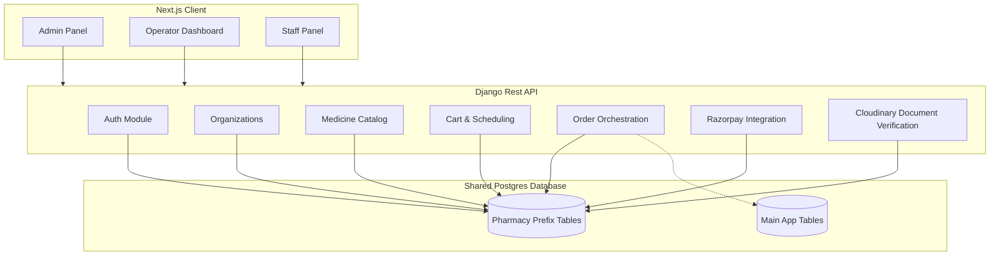

# Pharmacy Module - System Architecture

This document details the system architecture, database isolation, and entity schemas of the Pharmacy Module.

## 1. Architectural Overview

The Pharmacy Module is designed as an isolated component sharing a single Postgres database with other platform modules (like Consultation/Lab). It enforces strict table-level isolation through prefixed database tables, independent session cookies, and runtime database registry redirection.

### Key Isolation Characteristics
* **Table Prefixes**: All database tables for this module are prefixed with `pharmacy_` to avoid collisions with the main application or other isolated modules.
* **Shared-DB Isolation**: Using Django configurations, the module redirects core tables (such as Django ContentType and Session tables) to module-specific tables.
* **Stateless Token Authentication**: Authentication is powered by JSON Web Tokens (JWT) signed by a shared cryptographic secret, allowing secure cross-module user resolution.

---

## 2. Core Entities & Data Models

### 2.1 Authentication & Memberships

#### `PharmacyUser` (Table: `pharmacy_user`)
Custom user model replacing the default Django user model for administrative and operational staff.
* **`id`**: `BigAutoField` (Primary Key)
* **`email`**: `EmailField` (Unique, Username)
* **`name`**: `CharField` (Full Name)
* **`phone`**: `CharField`
* **`role`**: `CharField` (`PHARMACY_ADMIN`, `PHARMACY_STAFF`, `PHARMACY_OPERATOR`)
* **`status`**: `CharField` (`ACTIVE`, `INACTIVE` for OTP verification status)

#### `PharmacyOrganizationMembership` (Table: `pharmacy_organization_membership`)
Maps users to specific organizations with roles.
* **`user`**: ForeignKey to `PharmacyUser`
* **`organization`**: ForeignKey to `PharmacyOrganization`
* **`role`**: `CharField` (`ADMIN`, `MEMBER`)
* **`is_active`**: `BooleanField` (Default: `True`)

#### `PharmacyOTP` (Table: `pharmacy_otp`)
Stores transient OTP codes for email verification and password resets.
* **`user`**: ForeignKey to `PharmacyUser`
* **`otp`**: `CharField` (6-digit code)
* **`created_at`**: `DateTimeField` (auto-now)

---

### 2.2 Organizations & Catalog

#### `PharmacyOrganization` (Table: `pharmacy_organization`)
Entities providing services (Pharmacies, Clinics, Hospitals, NGOs).
* **`id`**: `UUIDField` (Primary Key)
* **`name`**: `CharField`
* **`type`**: `CharField` (`CLINIC`, `HOSPITAL`, `PHARMACY`, `NGO`)
* **`registration_number`**: `CharField` (Unique)
* **`license_number`**: `CharField` (Unique)
* **`address_line1` / `address_line2`**: `CharField`
* **`city` / `state` / `country` / `postal_code`**: `CharField`
* **`latitude` / `longitude`**: `DecimalField`
* **`status`**: `CharField` (`ACTIVE`, `INACTIVE`)
* **`verification_status`**: `CharField` (`PENDING`, `VERIFIED`, `REJECTED`)
* **`verified_by`**: ForeignKey to `PharmacyUser`
* **`verified_at`**: `DateTimeField`

#### `PharmacyMedicine` (Table: `pharmacy_medicine`)
Individual items in the catalog for each pharmacy.
* **`id`**: `UUIDField` (Primary Key)
* **`pharmacy`**: ForeignKey to `PharmacyOrganization`
* **`name`**: `CharField`
* **`category`**: `CharField`
* **`description`**: `TextField`
* **`price`**: `DecimalField` (Base Price)
* **`discount_price`**: `DecimalField` (Optional Promotional Price)
* **`fasting_required`**: `BooleanField`
* **`home_collection_available`**: `BooleanField`
* **`turnaround_time`**: `CharField` (e.g. "24 Hours")
* **`is_active`**: `BooleanField`

---

### 2.3 Cart & Order Management

#### `PharmacyCartItem` (Table: `pharmacy_cart`)
Stateless cart items stored for patients.
* **`id`**: `UUIDField` (Primary Key)
* **`patient_id`**: `UUIDField` (Linked to cross-module `Patient` user)
* **`pharmacy_medicine`**: ForeignKey to `PharmacyMedicine`
* **`collection_type`**: `CharField` (`HOME`, `PHARMACY_VISIT`)
* **`appointment_date`**: `DateField`
* **`slot`**: ForeignKey to `PharmacyTimeSlot`
* **`custom_home_slot`**: ForeignKey to `PharmacyHomeTiming`

#### `PharmacyMasterOrder` (Table: `pharmacy_master_order`)
The payment gateway container grouping sub-orders.
* **`id`**: `UUIDField` (Primary Key)
* **`patient_id`**: `UUIDField`
* **`total_amount`**: `DecimalField`
* **`payment_status`**: `CharField` (`PENDING`, `PAID`, `FAILED`, `REFUNDED`)
* **`razorpay_order_id`**: `CharField`
* **`razorpay_payment_id`**: `CharField`

#### `PharmacyOrder` (Table: `pharmacy_order`)
The sub-order details directed to a single pharmacy.
* **`id`**: `UUIDField` (Primary Key)
* **`master_order`**: ForeignKey to `PharmacyMasterOrder`
* **`patient_id`**: `UUIDField`
* **`pharmacy`**: ForeignKey to `PharmacyOrganization`
* **`collection_type`**: `CharField` (`HOME`, `PHARMACY_VISIT`)
* **`slot`**: ForeignKey to `PharmacyTimeSlot`
* **`custom_home_slot`**: ForeignKey to `PharmacyHomeTiming`
* **`appointment_date`**: `DateField`
* **`patient_name` / `patient_phone` / `patient_email`**: Personal patient details
* **`patient_age` / `patient_gender` / `patient_address`**: Physical attributes & delivery address
* **`status`**: `CharField` (`PENDING`, `BOOKED`, `COMPLETED`, `CANCELLED`)
* **`total_amount`**: `DecimalField`
* **`referred_by_doctor`**: `CharField` (Doctor Name reference)

#### `PharmacyOrderItem` (Table: `pharmacy_order_item`)
Individual medicine rows linked to a sub-order.
* **`order`**: ForeignKey to `PharmacyOrder`
* **`medicine`**: ForeignKey to `PharmacyMedicine`
* **`price_at_order`**: `DecimalField` (Locked price)
* **`status`**: `CharField` (`PENDING`, `COLLECTED`, `PROCESSING`, `COMPLETED`, `FAILED`)

---

### 2.4 Payments & Deliveries

#### `PharmacyPayment` (Table: `pharmacy_payment`)
Transaction records for audits and reconciliation.
* **`payer_id`**: `UUIDField` (Payer patient reference)
* **`reference_type`**: `CharField` (`PHARMACY_ORDER` etc.)
* **`reference_id`**: `UUIDField` (Linked Order ID)
* **`amount`**: `DecimalField`
* **`platform_fee`**: `DecimalField`
* **`payment_method`**: `CharField` (`UPI`, `CARD`, `NETBANKING`, `WALLET`)
* **`status`**: `CharField` (`PENDING`, `SUCCESS`, `FAILED`, `REFUNDED`)
* **`transaction_id`**: `CharField` (Internal Transaction UID)
* **`gateway_payment_id`**: `CharField` (Razorpay Payment ID)
* **`idempotency_key`**: `CharField`

#### `PharmacyDelivery` (Table: `pharmacy_order_package_collection`)
Delivery status tracking.
* **`pharmacy_order`**: ForeignKey to `PharmacyOrder`
* **`collection_type`**: `CharField` (`HOME`, `PHARMACY_VISIT`)
* **`delivery_agent`**: ForeignKey to `PharmacyUser` (Assigned agent)
* **`delivery_agent_name`**: `CharField`
* **`scheduled_at`**: `DateTimeField`
* **`status`**: `CharField` (`SCHEDULED`, `PICKED`, `IN_TRANSIT`, `REACHED_FACILITY`, `COMPLETED`, `FAILED`, `RESCHEDULED`)
